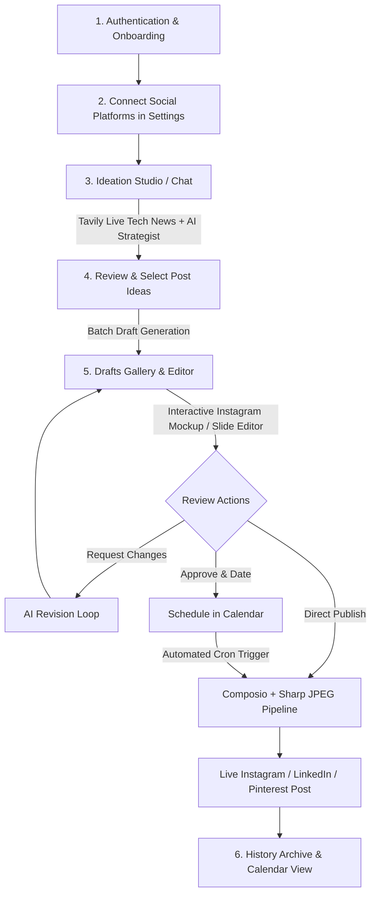

# Regardless - End-to-End User Workflow & Feature Guide

Welcome to **Regardless** — an autonomous AI content studio and social media publishing pipeline engineered for tech creators, educators, and brands. 

This document provides a comprehensive, page-by-page walkthrough of the user journey, explaining how each feature connects into a cohesive content production and publishing workflow.

---

## 🗺️ Architectural Workflow Overview

---

## 📱 Page-by-Page Workflow & Interaction Guide

---

### 1. Authentication & Workspace Setup
* **Routes**: `/auth/signup` & `/auth/signin`

#### User Goal
Create an account, securely sign in, and establish a dedicated workspace for your content pipeline.

#### User Journey & Interactions
1. **Sign Up (`/auth/signup`)**:
   - Enter your **Full Name**, **Email Address**, and a **Password** (min. 6 characters).
   - Click **"Create workspace"**.
   - The platform creates your account, hashes credentials securely using `bcrypt`, and automatically initiates your authenticated JWT session.
2. **Sign In (`/auth/signin`)**:
   - Enter your registered email and password.
   - Click **"Sign In"** to open your dashboard.

---

### 2. Settings & Social Media Connections
* **Route**: `/settings`

#### User Goal
Link your creator and business social media accounts so Regardless can publish posts and carousels directly to your feeds without third-party tool hopping.

#### Key Features & Supported Platforms
* **Instagram Business / Creator Accounts**: Connect via OAuth with permissions for single posts and multi-slide carousel containers.
* **LinkedIn**: Connect personal profiles or company pages.
* **Pinterest**: Connect boards for automated infographic pins.

#### User Journey & Interactions
1. Navigate to **Settings** from the sidebar.
2. Under **Platform Connections**, locate the platform card (e.g., **Instagram**).
3. Click **"Connect"** — a secure Composio OAuth modal will open.
4. Authorize your Instagram Business account.
5. Upon redirect, the card instantly turns **Connected** with a green status badge and displays your connected `@handle`.
6. Use **"Check Status"** or **"Refresh"** to verify token health at any time.

---

### 3. Ideation Studio & Live News Search
* **Route**: `/chat`

#### User Goal
Generate viral, data-backed tech post ideas grounded in breaking real-time industry news and customized to your specific brand tone.

#### Key Features
* **Live News Ingestion**: Integrates **Tavily AI Search** to fetch real-time tech news (AI model drops, funding rounds, big tech drama, open-source releases).
* **Multi-Platform Targeting**: Choose whether ideas should be targeted for Instagram carousels, LinkedIn thought leadership, or Pinterest infographics.
* **Brand Voice Enforcement**: Applies Regardless's signature **opinionated, analytical, no-filter** perspective.
* **Topic Presets & Custom Keywords**: Select general tech topics or input specific keywords (e.g., *"Claude 3.7 Sonnet"*, *"Nvidia inference chips"*).

#### User Journey & Interactions
1. In the **Ideation Studio**, click to toggle your target platforms (**Instagram**, **LinkedIn**, **Pinterest**).
2. Choose an **Industry Focus** from the dropdown (or leave on *"All Tech Industry News"*).
3. *(Optional)* Type a specific tech keyword or breaking event in the **Custom Topic** input.
4. Select the number of post concepts to generate (3 to 6 ideas).
5. Click **"Generate Tech Post Ideas"**.
6. The system executes a live web search, summarizes context, and drafts comprehensive post concepts (with Hook, Angle, Key Points, Format, and CTA).
7. You are automatically guided to the **Post Ideas** review screen.

---

### 4. Post Ideas Review & Selection
* **Route**: `/ideas`

#### User Goal
Review generated ideas, inspect their structural hooks and angles, and batch-select concepts to convert into full slide decks and drafts.

#### Key Features
* Interactive card selector with expandable hooks and talking points.
* Platform and format badges (e.g., `Carousel`, `Infographic Pin`, `Thought Leadership`).
* Multi-selection controls (**Select All**, **Deselect All**, or selective checkbox toggling).

#### User Journey & Interactions
1. Inspect each idea card's **Title**, **Description**, and **Target Platform**.
2. Click the chevron on any card to reveal its strategic **Hook**, **Angle**, and **Key Points**.
3. Select the checkboxes for the concepts you wish to produce.
4. Click **"Generate [N] Drafts"**.
5. Regardless's AI draft engine generates complete multi-slide carousels (with headlines, takes, slide counts, copy, and hashtags) and redirects you to the **Drafts** studio.

---

### 5. Drafts Gallery & Editorial Studio
* **Route**: `/drafts`

#### User Goal
Review, fine-tune, regenerate slide artwork, approve, schedule, or immediately publish draft posts.

#### Key Features
* **Drafts Gallery**:
  - **View Modes**: Switch between **Grid** and **List** layouts.
  - **Slide Thumbnail Previews**: Real-time slide counter badges and visual preview cards.
  - **Filters**: Filter by status (`Drafted`, `In Revision`, `Approved`, `Scheduled`, `Failed`) and platform (`Instagram`, `LinkedIn`, `Pinterest`).
  - **Live Search**: Fast search by title or caption keywords.
* **Authentic Instagram Mockup Inspector**:
  - **Accurate Phone Layout**: 4:5 portrait preview with account handle, avatar, carousel dot indicators, and Instagram action bar (heart, comment, share, save).
  - **Inline Caption**: Integrated headline, body copy, and hashtags rendered exactly as seen on Instagram.
* **Card Template Typography Engine (Satori / @vercel/og)**:
  - Generates 1080x1350px dark-mode cards (`#12141C` flat background, `#F5F4FA` bold Inter typography, `#8B7FE8` accent bars, `#B9B4F5` counter pills, and `@regardless.ai` handle branding).
* **Interactive Slide Editor & Regenerator**:
  - Slide-by-slide navigation with previous/next arrows.
  - **"Edit Slide Text"**: Custom edit headline and body text per slide with real-time template re-rendering.
  - **"Regenerate AI Graphic"**: Generate fresh custom slide visuals on demand.
* **Editorial Review Actions**:
  - **"Approve"**: Mark draft as verified and ready for scheduling or publishing.
  - **"Revise"**: Submit natural language feedback to have the AI revise copy, tone, or structure.
  - **"Schedule"**: Select a future publishing date and time.
  - **"Publish Now (INSTAGRAM)"**: Directly trigger immediate publishing to your connected account.

#### User Journey & Interactions
1. Click any draft card from the gallery to open the full **Editorial Inspector**.
2. Flip through the carousel slides using the navigation arrows.
3. If you want to tweak slide wording, click **"Edit Slide Text"**, adjust the headline or take line, and click **"Apply Changes"**.
4. To refine the post copy with AI, click **"Revise"**, enter your feedback (e.g., *"Make the hook punchier"*), and submit.
5. When satisfied, click **"Approve"**.
6. Choose your next step:
   - Click **"Schedule"** to queue the post for automated release.
   - OR click **"Publish Now"** — the button will show a loading spinner (`Publishing to INSTAGRAM...`), convert all 6 slides into Instagram-compliant JPEGs, upload to S3, create the carousel container, and publish live to Instagram within seconds!
7. Once published, the post automatically transfers to your **History** archive.

---

### 6. Calendar & Content Schedule
* **Route**: `/calendar`

#### User Goal
Visualize your upcoming publishing queue and review past published content across days, weeks, and months.

#### Key Features
* **Multi-View Modes**: Switch dynamically between **Day**, **4-Day**, **Week**, and **Month** grids.
* **Unified Status Tracking**: Displays both upcoming **Scheduled** drafts and successfully **Published** posts with exact timestamps.
* **Platform Badging**: Branded color pills with platform icons (Instagram, LinkedIn, Pinterest).
* **Click-Through Navigation**: Click any scheduled post to edit in Drafts, or click a published post to open its History record.
* **Quick Post Creation**: Click on any empty calendar day to jump directly into an ideation session pre-targeted for that date.

---

### 7. Kanban Workflow Board
* **Route**: `/kanban`

#### User Goal
Manage your content pipeline visually across all production phases using a clean column board.

#### Workflow Stages (Columns)
1. **Ideas**: Raw concepts generated from tech news.
2. **Selected**: Ideas chosen for production.
3. **Drafted**: Multi-slide decks generated and awaiting review.
4. **In Revision**: Posts undergoing editorial prompt adjustments.
5. **Approved**: Verified posts ready for publishing or scheduling.
6. **Scheduled**: Posts queued with fixed release timestamps.
7. **Posted**: Content live on social platforms.

---

### 8. History & Published Archive
* **Route**: `/history`

#### User Goal
Track, audit, and analyze all published content across your social channels.

#### Key Features
* Chronological record of all live posts with direct platform post IDs and live URLs.
* Complete snapshot of the published carousel slides, captions, and hashtags.
* Filter and search through historical publications.

---

## ⚙️ Technical Publishing Pipeline Under the Hood

When a post is published, Regardless executes the following automated pipeline:

1. **Slide Image Formatting (`src/lib/publisher.ts`)**:
   - Formats every slide in `content.slides` into full-bleed 1080x1350px image assets via the code-rendered template generator (`/api/og/slide`).
2. **Sharp JPEG Conversion Engine (`src/lib/composio.ts`)**:
   - Instagram Graph API strictly requires `image/jpeg`. Sharp dynamically converts all PNG buffers to high-quality JPEG buffers (`quality: 95`, `4:4:4` chroma) on the fly.
3. **S3 Asset Upload (`Composio Files API`)**:
   - Each slide JPEG is uploaded to a temporary signed S3 container with `mimetype: 'image/jpeg'`.
4. **Carousel Container Creation (`INSTAGRAM_CREATE_CAROUSEL_CONTAINER`)**:
   - Instagram creates the multi-slide container linking all child slides and the full multi-paragraph caption with hashtags.
5. **Container Publish (`INSTAGRAM_POST_IG_USER_MEDIA_PUBLISH`)**:
   - Executes the live publish call, verifies successful media ID return, and transitions the post status to `POSTED`.

---

## 🚀 Quick Start Summary for New Users

| Step | Action | Page | Outcome |
| :--- | :--- | :--- | :--- |
| **1** | Connect Instagram | **Settings** (`/settings`) | Authenticates your creator account via Composio |
| **2** | Generate Ideas | **Chat** (`/chat`) | Scans live tech news and crafts post hooks |
| **3** | Select Concepts | **Ideas** (`/ideas`) | Choose 1 or more ideas and click "Generate Drafts" |
| **4** | Review & Edit | **Drafts** (`/drafts`) | Inspect authentic Instagram mockup, tweak slides |
| **5** | Publish or Schedule | **Drafts** (`/drafts`) | Click "Publish Now" to post immediately or "Schedule" |
| **6** | Track Schedule | **Calendar** (`/calendar`) | View scheduled queue and published post history |
